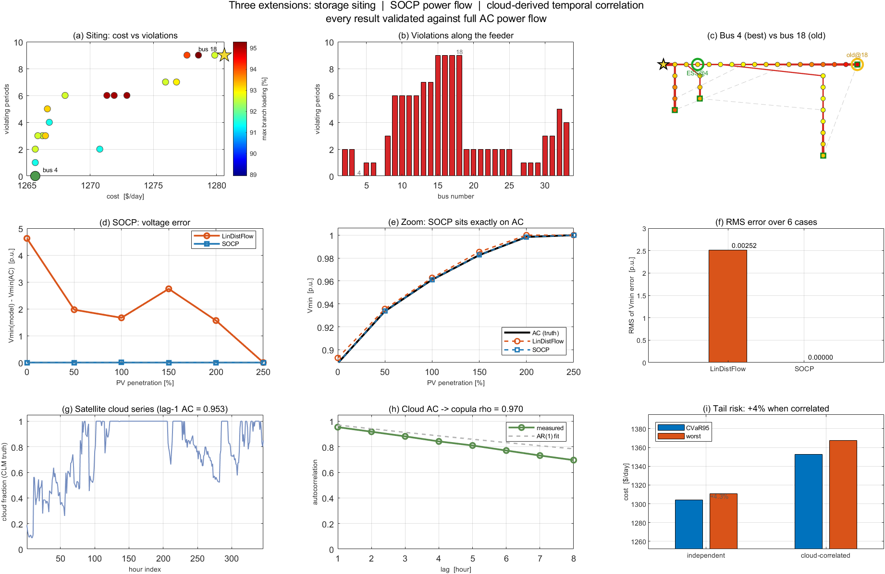
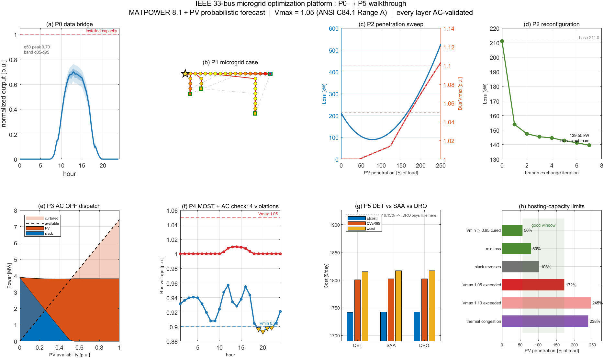
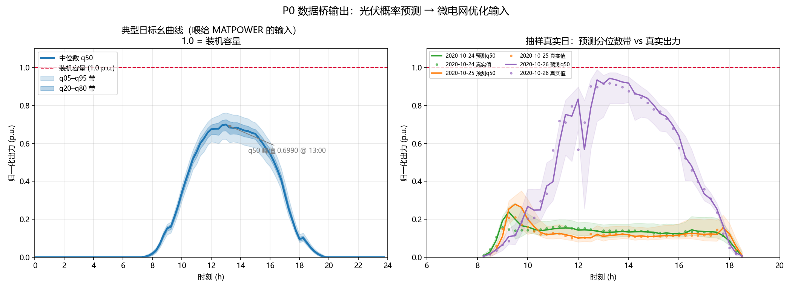
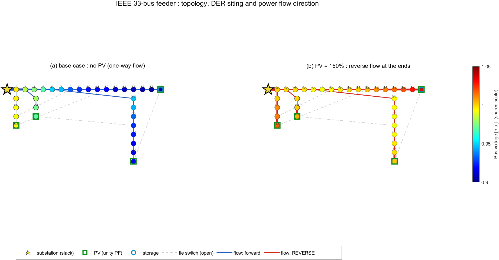
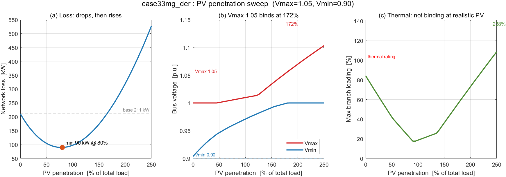
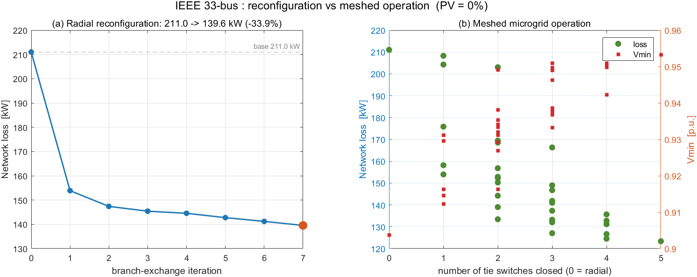
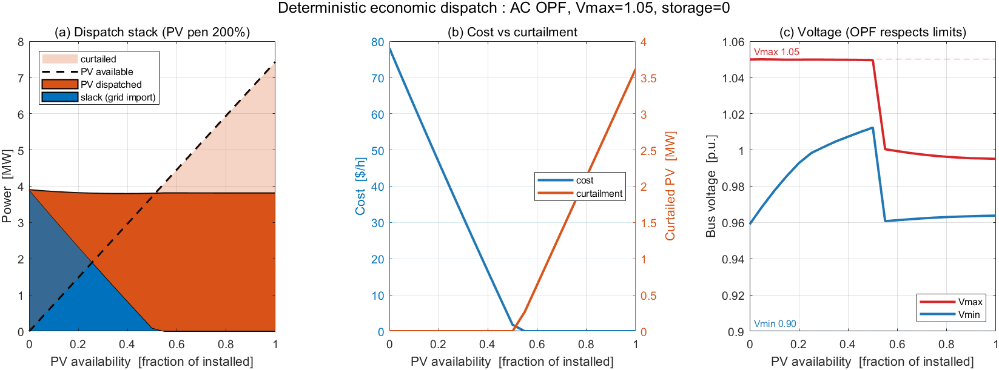
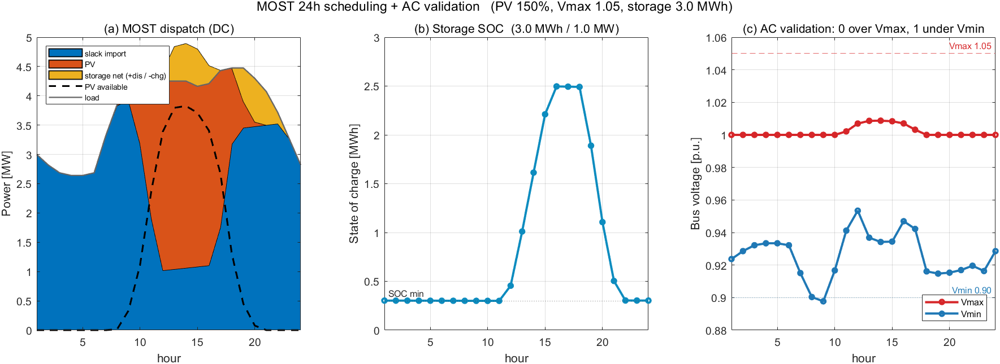
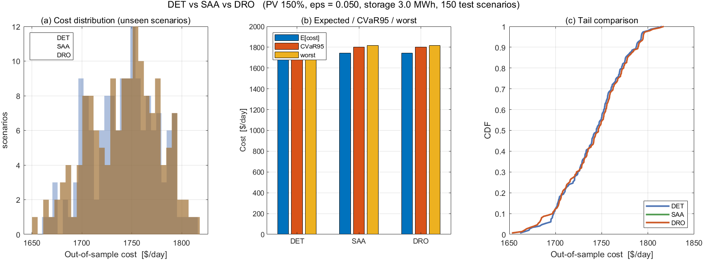

# 微电网分布鲁棒优化预研平台

一个**独立可复现**的微电网优化研究平台：以 IEEE 33 节点配电网为载体，把光伏
**概率预测**作为不确定性输入接进日前调度，再用 MATPOWER 全交流潮流对每一个
优化解做物理校验，形成「概率预测 → 优化调度 → AC 真值校验」闭环。

设计上有一条贯穿始终的原则：**简化模型负责优化，全交流潮流负责说真话。**
线性化/直流模型让问题可解，但它们看不见电压、忽略线损；所以每一层的解都要
回灌 MATPOWER 校验，并把简化模型与真值的 gap 量出来。

> 📄 **完整项目说明见 [`docs/项目说明.md`](docs/项目说明.md)** ——
> 含架构、MATPOWER 在本项目中的具体角色、能力清单、数据流、
> 已知限制与可优化点（18 条）、术语表。

---

## 快速开始

```bash
# 1) 生成数据（必须用 pv 项目的 Python 环境，因为要 import 已有模型）
D:\anaconda\python.exe D:\microgrid-dro\bridge\export_pv.py

# 2) 后续 MATLAB 算例（P1 起）
matlab -batch "run('D:\microgrid-dro\src\...')"
```

前置：MATPOWER 8.1 已装在 `D:\matpower`，路径已永久写入 MATLAB R2024a。

---

## 环境

| 项 | 值 |
|---|---|
| MATLAB | R2024a @ `D:\MATLAB` |
| MATPOWER | 8.1 (2025-07-12) @ `D:\matpower` |
| 求解器 | MIPS（自带，无需 Optimization Toolbox） |
| 附加工具箱 | Optimization Toolbox（`linprog`/`quadprog`/`fmincon`/`intlinprog`）、Global Optimization、Statistics and ML |
| Python（数据桥用） | `D:\anaconda\python.exe`（3.8.5 + torch 2.4.1+cpu） |
| 上游数据源 | 配套的光伏概率预测项目（**只读，不修改**） |

---

## 目录结构

```
D:\microgrid-dro\
├── bridge/     数据桥（Python，从 pv 项目取预测 → 导出 CSV）
│   ├── export_pv.py        取 11 分位数 → CSV
│   └── plot_profile.py     日内曲线出图
├── data/       导出的 CSV（pv_quantile.csv / pv_daily_profile*.csv / meta.json）
├── cases/      MATPOWER 算例
│   └── case33mg_der.m      PV + 储能 + 热限值（P1）
├── src/        脚本
│   ├── demo_matpower.m          MATPOWER 快速体验
│   ├── test_p1_regression.m     P1 回归测试（25 项）
│   ├── sweep_pv_penetration.m   P2 渗透率扫描（数据落盘）
│   └── reconfigure.m            P2 网络重构 / 环网运行
├── results/    输出
│   ├── data/   CSV（扫描与重构数据，文件名带 vmax 标记便于对比）
│   └── figures/ 图
└── docs/       原理与运行说明
```

## 约定：电压限值一律显式给

**本项目所有阶段统一用 `Vmax = 1.05`（ANSI C84.1 Range A 的配电网限值）**，
而不是 `case33mg` 默认的 1.1（输电系统默认值）。

理由：实测同一套扫描下，过 1.05 在 172% 渗透率触发，过 1.10 要 245% ——
**差 40% 以上，"光伏承载力"这个结论完全变样**。下界保持 0.90（基态已越 ANSI 的 0.95）。

后续若要补「1.05 vs 1.10」对比，直接读两份 CSV 叠加即可：

```matlab
T105 = readtable('results/data/sweep_pv_vmax105.csv');
T110 = readtable('results/data/sweep_pv_vmax110.csv');
plot(T105.pen*100, T105.vmax_pu, T110.pen*100, T110.vmax_pu);
```

---

## 数据桥（P0，已完成）

`bridge/export_pv.py` 把上游的光伏概率预测转成 MATLAB 能读的 CSV。**只读上游，不改上游。**

它做四件事：

1. **重跑推理拿全 11 个分位数。** 上游的 `results/predictions_quantile.npz` 只存了
   q05/q50/q95 三个 —— 11 分位数的张量只存在于模型输出内存，`evaluate.py:119-122`
   切片后即丢。所以必须重跑（模板取自 `dro_demo.py:33-52`）。
   已交叉验证：重跑的 q05/q50/q95 与上游 npz **逐比特一致（最大差 = 0）**。
2. **修分位数交叉 + 截断负值。**
3. **导出全时段分位数** → `data/pv_quantile.csv`（4400 行，time + q05..q95 + y_true，单位 kW）。
4. **聚合成日内标幺曲线** → `data/pv_daily_profile.csv`（96 点，15 分钟）
   与 `data/pv_daily_profile_hourly.csv`（24 点，给 MOST 的 nt=24）。

### 输出文件

| 文件 | 内容 |
|---|---|
| `pv_quantile.csv` | 4400 行 × 13 列：time, q05..q95, y_true（kW） |
| `pv_daily_profile.csv` | 96 点标幺日内曲线（15 分钟分辨率） |
| `pv_daily_profile_hourly.csv` | 24 点标幺日内曲线（给 MOST） |
| `pv_profile_meta.json` | 归一化基准、清洗统计、覆盖时段等元数据 |

### ★ 归一化约定：1.0 = 装机容量（物理硬上限）

分母取**原始逐点序列的全局最大值**（= 46849.6 kW），**不是**日均曲线峰值。

理由：1.0 必须有明确物理含义 —— 1.0 = 装机容量，而光伏出力不可能超过装机容量。
若按日均曲线峰值（35663 kW）归一，个别晴天（强于平均日）会冲到 **1.31 p.u.**，
且 **21% 的逐点值越界**，MATLAB 侧就没法把 1.0 当容量上限用，整个链条自相矛盾。

代价：日均曲线峰值只有 **0.7612 p.u.**（典型日出力达装机的 76.1%）。
这符合实际 —— 光伏电站很少在典型日打到铭牌。

| 量 | 值 (p.u.) |
|---|---|
| 逐点最大 (q95) | 1.0000 |
| `y_true` 最大 | 0.9651 |
| 日均曲线峰值 (q95) | 0.7612 |
| q50 日均峰值 | 0.6990 |
| q05 日均峰值 | 0.6217 |
| 正午不确定性带宽 (q95−q05) @12:00 | 0.1218 |
| 日出 / 日落边界 | 07:30 / 19:30 |

自检项「原始逐点全 ≤ 1.0」和「日均峰值 < 1.0」就是守这条约定的。

**量级说明**：上游数据是 **50MW 电站**，而 IEEE 33 节点总负荷只有 **3.715MW**（差 13 倍）。
所以本桥**只导出归一化形状**，绝对容量由 MATLAB 侧按渗透率决定：
`P_actual_MW = 渗透率 × 本地装机 × 标幺曲线`。微电网研究看的是渗透率，不是绝对 MW。

### 数据质量（已实测）

| 项 | 数值 | 处理 |
|---|---|---|
| 分位数交叉 | 1373/4400 行（31%），最大 380 kW | `np.maximum.accumulate` |
| 负值 | q05 147 个、q10 104 个、q20 35 个… | `max(P, 0)` 截断 |
| 测试集时段 | 仅 07:00–19:00（上游 `DAYTIME_ONLY=True`） | 夜间补 0（**物理正确**，光伏夜间本就为 0） |
| 覆盖 | 2020-09-14 ~ 2020-12-31，109 天 | — |

**关于修交叉方法的选择**（实测对比）：

| 方法 | L1 扰动 | q50 均值偏移 | q05 均值偏移 |
|---|---|---|---|
| `np.maximum.accumulate` | 116150 | **+0.3 kW** | **+0.0 kW** |
| `np.sort` | 223888 | −10.6 kW | −0.6 kW |

交叉多是"相邻两档轻微逆序"，accumulate 只把低档抬到最小必要值；sort 会跨整行重排，
扰动大一倍。故选 accumulate（也与上游 `calibrate.py:62` 一致）。

---

## ★ 两个决定架构的硬约束

### 1. MOST 是纯 DC，看不见电压

`most/README.md:15-18` 原文：*"the current implementation is limited to **DC power flow
modeling** of the network"*。`most/lib/most.m` 中无 `makeYbus`/`Vm`/`Va`，
选项 `most.dc_model` 只有 0/1，**不存在 AC 取值**。

→ 光伏反送导致的过电压（Vmax=1.1）在 MOST 里完全不可见。
**"先 MOST 定时序调度 → 再逐时段回灌 MATPOWER AC 校验"的两段式是结构必需的。**

### 2. `case33mg` 所有支路 `RATE_A = 0`（实测 37 条全为 0）

→ DC 网络无阻塞 → 零成本光伏必然顶到 PMAX → **MOST 里永远看不到弃光**。

→ 需给支路加合理热稳定限值，并在文档标注这是"对标准算例的刻意扩展"。

---

## 已实测的算例基准

| 算例 | 结果 |
|---|---|
| `case33bw`（Baran-Wu） | baseMVA=10，PF 3 迭代收敛，网损 **202.7 kW**，Vmin **0.9131** @bus18 ← 与文献一致 |
| `case33mg`（Kashem） | baseMVA=1，PF 4 迭代收敛，网损 **211.0 kW**，Vmin **0.9038** @bus18 |
| `case33mg` 联络全合（环网） | 收敛，网损 **123.4 kW**（↓41%），Vmin **0.9532** |
| `case9` OPF | **5296.69 $/h**（官方基准，一致） |

联络开关：21-8、9-15、12-22、18-33、25-29（常态断开）→ 2⁵ = **32 种组合可穷举**。

**潮流算法选择**：辐射态用 `pf.alg='PQSUM'` + `pf.radial.vcorr=1`（前推回代，专为高 R/X 配网）；
一旦闭合任一联络开关，**必须退回 `'NR'`**（`radial_pf.m:36-38` 遇环直接报错）。

---

## 微电网算例（P1，已完成）

`cases/case33mg_der.m` —— 在 MATPOWER 自带 `case33mg` 上叠加 **光伏 + 储能 + 支路热限值**。

```matlab
mpc        = case33mg_der();                                  % 默认 50% 渗透率
mpc        = case33mg_der('pv_penetration', 1.0, 'vmax', 1.05);
[mpc, der] = case33mg_der();                                  % der: 派生参数（供 MOST/DRO 用）
```

| 选项 | 默认 | 说明 |
|---|---|---|
| `pv_penetration` | 0.50 | 光伏装机 / 总负荷 |
| `pv_buses` | `[18 22 25 33]` | 光伏接入母线（均为馈线末端） |
| `pv_available` | 1.0 | 光伏可用出力系数（潮流用 `Pg = 装机 × 系数`） |
| `storage` / `storage_bus` | `true` / `18` | 储能开关与接入点 |
| `storage_power` / `storage_energy` | 1.0 MW / 3.0 MWh | 储能功率/能量容量 |
| `thermal` / `i_rated` | `true` / `300 A` | 热限值开关与导体载流量 |
| `vmax` / `vmin` | `[]`（保持 1.1 / 0.9） | 电压限值 |
| `load_scale` | 1.0 | 负荷整体缩放 |

**验收**：`src/test_p1_regression.m`，**25 项全过**。核心闸门是 TEST 1 ——
把 DER 全关掉后 `case33mg_der` 与 `case33mg` 的 bus/branch/gen/gencost **逐比特一致（maxdiff = 0）**，
保证叠加 DER 时没改坏标准算例。

### 建模要点（踩过的坑）

- **储能 = 一行 PMIN 为负的普通机组**：`PMAX=+Pcap` 放电、`PMIN=-Pcap` 充电。
  储能容量**必须相对负荷重设** —— MOST 示例 `ex_storage.m` 用 200 MWh，
  相对本算例 3.715 MW 总负荷是 **54 倍**，照抄会严重失真。本算例用 3 MWh / 1 MW。
- **光伏设 `PG` 而不是只设 `PMAX`**。`PG` 才是潮流用的实际注入量，`PMAX`/`PMIN` 只是 OPF 上下界。
  只设后者会导致潮流里光伏完全不起作用（这个坑实测踩过）。
- **光伏用单位功率因数、母线保持 PQ 类型**。这样光伏不参与调压，电压会自然顶上去，
  才能复现反向潮流导致的过电压。
- **`RATE_A` 与 `VMAX` 都不影响 `runpf`** —— 潮流不校验容量和电压，它们只对 OPF/MOST 起作用。
  所以加这些限制不会破坏潮流回归。

### ★ 关键发现：本馈线的瓶颈是电压，不是热容量

`case33mg` 的 `Vmax = 1.1` 是**输电系统的默认值**，对 12.66 kV 配电网过于宽松
（ANSI C84.1 Range A 只允许 **1.05**）。这直接改变结论：

| 约束 | 触发渗透率 |
|---|---|
| 网损最低点 | **80%**（89.6 kW，比基态 211 kW 降 58%） |
| Slack 由输入转输出 | **102.7%** |
| 过电压（> 1.05，配电网实际限值） | **171.8%** |
| 过电压（> 1.10，case33mg 默认） | 244.9% |
| 支路热阻塞 | 237.7% |

**在现实渗透率（50–150%）下没有任何支路接近阻塞**（最高负载率才 42%），
但用 1.05 限值时过电压已经在 172% 出现。所以：**配电网研究应显式传 `'vmax', 1.05`**，
否则会把"光伏承载力"高估 40% 以上。

> 这也是为什么 MOST 的两段式（DC 调度 → AC 校验）是**结构必需**：
> MOST 看不见电压，而电压恰恰是本算例真正的约束。

**效果图**：见下方 P2 的 `results/figures/sweep_pv_vmax105.png`（同一张三联图，含数据落盘）

---

## 潮流层（P2，已完成）

### 渗透率扫描 `src/sweep_pv_penetration.m`

```matlab
T = sweep_pv_penetration();                          % 默认 Vmax=1.05, Vmin=0.90
T = sweep_pv_penetration('vmax', 1.10);              % 换限值再跑一遍
```

**数据落盘**：`results/data/sweep_pv_vmax105.csv`（51 行 × 16 列）+ 同名 `.meta.json`。
文件名带 `vmax` 标记，所以「1.05 vs 1.10」的对比可以直接读两份 CSV 叠加。

实测结果（Vmax=1.05）：

| 事件 | 渗透率 |
|---|---|
| 网损最低 **89.6 kW** | **80%**（比基态 211 kW 降 58%） |
| Slack 由输入转输出 | 102.7% |
| **Vmax 1.05 首次越限** | **171.8%** |
| Vmin 0.90 首次恢复（全馈线≥0.90） | ~130% |
| 支路热阻塞 | 237.7% |

> **基态本身就是低电压的**：0% 光伏时已有 **21/33 个节点低于 0.95**（Vmin=0.9038@bus18）。
> IEEE 33 节点是出了名的重载弱馈线。所以光伏的角色是双面的 ——
> **先帮馈线治低电压，过了 172% 才变成过电压问题**。
> 这也是为什么本算例的下限保持 0.90 而不是 ANSI 的 0.95：用 0.95 基态就不可行了。

### 网络重构 `src/reconfigure.m`

```matlab
[Trad, Tmesh] = reconfigure();
[Trad, Tmesh] = reconfigure('pv_penetration', 0.8);
```

做两件**不同**的事（容易混淆）：

**【A】径向重构** —— 合一个联络开关 + 断环路上一个分段开关，保持辐射状。
用 **branch-exchange 局部搜索**（不是单步枚举：单步只能到 153.87 kW，
够不到经典最优，因为最优需要同时换掉多个开关）。

```
base  211.00 kW  [33 34 35 36 37]
iter1 153.87     [8 33 34 36 37]
...
iter7 139.55     [7 9 14 32 37]   ← 经典最优
```

**收敛到 139.55 kW / 断开支路 [7 9 14 32 37]，正是 IEEE 33 节点重构的经典文献值。**
平台独立复现了这个结果（446 次潮流，< 1 秒），是对正确性的强验证。

**【B】微电网环网运行** —— 合上任意子集联络开关，**允许环网**（2⁵=32 种）。
对微电网这是合法运行方式（多电源互备）。**全部合上 → 123.37 kW（-41.5%）**，
Vmin 从 0.9038 抬到 0.9532。

> ⚠️ MATPOWER 的前推回代算法 (`pf.alg='PQSUM'`) **遇环直接报错**，
> 所以环网态必须用牛顿法（默认 `'NR'`）。

**效果图**：`results/figures/sweep_pv_vmax105.png`、`reconfigure_pv000_vmax105.png`

---

## 确定性经济调度（P3，已完成）

`src/run_ed.m` —— 单时段 AC OPF，扫描光伏可用系数。

```matlab
T = run_ed();                                        % PV 200%，avail 0:0.05:1
T = run_ed('pv_penetration', 1.0, 'allow_export', true);
```

**数据落盘**：`results/data/ed_sweep_pen200_vmax105.csv`

### ★ 单时段 OPF 必须关掉储能（否则结果失真）

单时段 OPF 没有 SOC 约束（SOC 是跨时段耦合），储能又零成本，于是它会**任意充放**。
实测 pen=100% 时储能自由放电 **0.697 MW**，凭空把光伏挤出同样多，**制造出根本不存在的"弃光"**：

| | cost | 储能出力 | 光伏出力 | slack |
|---|---|---|---|---|
| 带储能 | 0.000 | **+0.697 MW** | 3.150 MW | 0 |
| 不带储能 | 1.798 | — | **3.715 MW（满发）** | 0.0899（仅补网损） |

所以 `run_ed` 默认 `'storage', false`。储能的真正建模在多时段 —— 见 P4 的 MOST。

### 实测结论（PV 200%，Vmax 1.05）

| 事件 | avail |
|---|---|
| 光伏完全顶掉 slack | **0.55** |
| 弃光开始 | **0.55**（可用 4.087 MW） |
| 光伏出力饱和于 **3.814 MW** | 之后一直饱和 |
| 最大弃光 **3.616 MW（占可用 48.7%）** | avail = 1.0 |

**弃光是"禁止反送"约束卡出来的，不是电压。** 饱和值 3.814 MW = 负荷 3.715 + 网损 0.099
—— 本算例平衡机（bus1 变电站）`PMIN = 0`，即不允许向主网反送，光伏出力被硬性限制在
「负荷 + 网损」以内。此时 Vmax 只有 **0.995**，离 1.05 还远，电压根本不是瓶颈。

> 这是一个真实的并网约束（很多分布式电源接入协议禁止或限制反送），但它会主导结果。
> 想放开就用 `'allow_export', true`（把平衡机 PMIN 改负）。

### ★ 数值验证：MIPS vs FMINCON 交叉校验

MIPS 在求解时会报 `MATLAB:nearlySingularMatrix`（RCOND ≈ 4.3e-20）。**这个警告无害**：

1. 它在**所有点都触发，包括 avail=0 的基态**（那时没有光伏）→ 是该算例 OPF 的
   KKT 系统固有特性，不是高光伏段的病态
2. 用独立求解器 **FMINCON 交叉验证**，两者一致：光伏出力差 **< 0.006 MW**，
   成本差 **< 0.002 $/h**

> MATLAB 的 AC OPF 可选求解器：`mpoption('opf.ac.solver', 'FMINCON')`。

**效果图**：`results/figures/ed_sweep_pen200_vmax105.png`（调度堆叠 / 成本与弃光 / 电压）

---

## 后续新增的三项能力



九个面板，一行一个主题。(a)–(c) 储能选址、(d)–(f) SOCP 潮流、(g)–(i) 云图时间相关。

| 面板 | 这张图在说什么 |
|---|---|
| (a) | 每个点是一个候选母线：横轴成本、纵轴电压越限时段、颜色是支路负载率。**成本挤成一条竖线（只差 0.4%），越限时段才是纵向拉开的那一维** —— 选址不能只看钱。黄星是原位置 bus 18（9 个时段越限），绿圈是最优 bus 4（0 个）。 |
| (b) | 沿馈线各母线的越限时段数。中间那一片（bus 10–18 附近）最差，因为它们是馈线末端、电压最脆弱；把储能放在这里反而加重问题。 |
| (c) | 拓扑图上标出两个位置：绿圈 = 最优 bus 4（靠近变电站），黄圈 = 原位置 bus 18（最末端）。 |
| (d) | 两个模型的电压误差随渗透率变化。**SOCP 是一条贴在 0 上的平线**，LinDistFlow 在 0.0016–0.0046 之间起伏。 |
| (e) | 放大看绝对电压：**黑线（交流真值）与蓝虚线（SOCP）完全重合**，橙虚线（LinDistFlow）肉眼可见地浮在上面。 |
| (f) | RMS 误差汇总：LinDistFlow **0.00252** vs SOCP **0.00000**。 |
| (g) | 卫星云量序列（CLM 官方云掩膜，346 小时）。**滞后 1 小时自相关 0.953** —— 云是强持续的。 |
| (h) | 实测自相关 vs AR(1) 拟合。灰虚线是拟合曲线，用于换算成高斯 Copula 的潜变量相关 **ρ = 0.970**。 |
| (i) | 把时间相关性接进场景生成器后的影响：**CVaR95 与最坏成本都上升约 4%** —— 忽略时间相关性会低估尾部风险。 |

### 储能选址优化 `src/optimize_storage_siting.m`

扫描全部 32 个候选母线，各自求解调度并回灌交流校验：

| 位置 | 成本 $/d | 电压越限时段 |
|---|---|---|
| bus 18（原默认，最弱末端） | 1280.6 | **9** |
| **bus 4（最优）** | **1265.7** | **0** |

**挪一个位置省 14.9 $/天并把越限时段清零。** 注意各母线成本只差 0.4%，
真正拉开差距的是电压越限时段数 —— 选址的目标函数不能只看经济性。

### 二阶锥 (SOCP) 潮流 `src/opt_dispatch_socp.m`

保留线损项、用锥约束耦合电流平方，辐射网下松弛是紧的。与全交流潮流对比
（`src/compare_distflow_models.m`，**相同注入**）：

| PV% | Vmin_AC | Vmin_Lin | Vmin_SOCP | err_Lin | **err_SOCP** |
|---|---|---|---|---|---|
| 0 | 0.8883 | 0.8929 | 0.8883 | +0.00462 | **0.00000** |
| 100 | 0.9611 | 0.9628 | 0.9611 | +0.00167 | **0.00000** |
| 200 | 0.9984 | 1.0000 | 0.9984 | +0.00156 | **0.00000** |

**SOCP 误差全为 0**；LinDistFlow RMS 0.00252，且方向性地对欠压乐观。

### 卫星云图 → 场景时间相关性 `bridge/analyze_cloud_correlation.py`

原场景生成器逐小时独立抽样（等于假设"这一小时与下一小时的光伏无关"）。
卫星云图实测显示云量滞后 1 小时自相关 **0.953**、相邻小时只变化 0.037。
用对并列值稳健的 Kendall τ 换算到高斯 Copula 潜变量相关：**ρ_time = 0.970**。
接进生成器后，场景的标准化异常自相关从 **−0.05（独立）变成 0.688**。

**影响（反直觉但合理）**：忽略时间相关性会**低估尾部风险约 4%** ——

| | 逐小时独立 | 云图时间相关 |
|---|---|---|
| E[成本] $/d | 1280.5 | 1278.1 |
| **CVaR95** | 1303.9 | **1352.5（+3.7%）** |
| **最坏成本** | 1310.6 | **1367.5（+4.3%）** |

原因是独立抽样让极端小时在日内被"平均掉"，而真实云是持续的，一个坏小时会连着一整天。

---

## 图件与解读

每一步的结果都出图。下面把图直接嵌进来，并逐张说明它在讲什么。

两张总览图：
- **P0 → P5 全景**：`OVERVIEW.png`（见下）—— 主线八个阶段
- **三项扩展总览**：`OVERVIEW_EXT.png`（见上文「后续新增的三项能力」）—— 选址 / SOCP / 云图

### 总览：P0 → P5 全景



一张图看完整条链路，八个面板从左到右、从上到下：

| 面板 | 阶段 | 这张图在说什么 |
|---|---|---|
| (a) | P0 | 光伏概率预测被压成一条标幺日内曲线。蓝带是 q05–q95，中间实线是 q50。**1.0 = 装机容量**，所以典型日峰值只到 0.70 —— 光伏很少在典型日打到铭牌。 |
| (b) | P1 | IEEE 33 节点馈线拓扑。节点颜色是电压，绿方块是光伏接入点（都在馈线末端），蓝圈是储能，黄星是变电站。支路越粗潮流越大，**蓝色正向、红色反向**。 |
| (c) | P2 | 渗透率扫描。左轴网损先降后升（局部消纳 → 反向潮流），右轴电压随渗透率单调上升。两条竖线标出"好窗口"两端。 |
| (d) | P2 | 分支交换重构的收敛轨迹：211 kW → **139.55 kW**，与 IEEE 33 节点经典文献最优值一致。 |
| (e) | P3 | AC 最优潮流的调度堆叠。slack（蓝）被光伏（橙）顶掉，超出负荷的部分变成弃光（浅橙）。 |
| (f) | P4 | MOST 的 24h 时序调度解，**经全交流潮流校验**。黄三角标出 4 个时段欠压 —— MOST 是纯 DC，本身看不见这件事。 |
| (g) | P5 | 确定性 / 随机 / 分布鲁棒三方对比。三组柱子几乎等高 —— 这就是本项目那个"否定结果"。 |
| (h) | P5 | 各约束的触发渗透率汇总，以及 Vmax 取 1.05 还是 1.10 的敏感性（差 43%）。 |

### P0 — 数据桥：光伏概率预测 → 可用的输入曲线



左图是被喂给优化模型的标幺日内曲线，右图是抽样真实日、预测分位数带与真实出力的对照。
注意**正午不确定性带最宽** —— 云扰动在中午最强，这正是概率预测要捕捉的东西。

### P1 — 微电网算例：拓扑与潮流方向



左基态、右 150% 光伏，**两图共用同一电压色标**（否则没法横向比较）。
基态全蓝（末端电压 0.90），150% 时整条馈线变黄红、且支路变红 —— 潮流方向翻转了。

### P2 — 渗透率扫描：为什么瓶颈是电压



(a) 网损在 80% 渗透率触底（89.6 kW，比基态降 58%），之后反向潮流主导、网损反弹；
(b) 电压随渗透率上升，**1.05 在 172% 越限**；(c) 支路负载率全程最高才 108%，
**热容量根本不是瓶颈**。

### P2 — 网络重构：独立复现经典最优



(a) 分支交换搜索 7 步收敛到 139.55 kW；(b) 32 组联络开关组合的环网运行散点 ——
合的联络开关越多，网损越低、最低电压越高。

### P3 — 确定性经济调度：弃光从哪来



(a) 调度堆叠：slack 在 avail=0.55 被光伏完全顶掉，之后光伏出力饱和、剩余变成弃光；
(b) 成本降到 0 后转为弃光增长；(c) 电压在 avail=0.55 有个**突变** ——
OPF 从上界 1.05 调节损耗的模式，切到降压"烧掉"多余光伏的模式。
**弃光是"禁止反送"约束卡出来的，不是电压**（饱和时 Vmax 才 0.995）。

### P4 — MOST 时序调度 + AC 校验



(a) MOST 的 DC 调度：储能中午充、傍晚放，做光伏时移；
(b) 储能 SOC 满充满放（0.30 → 3.00 MWh）；
(c) **把 DC 解回灌全交流潮流**：Vmin 在 19–22 时跌破 0.90。
MOST 是纯 DC 的，会认为自己的调度既最优又可行 —— 这就是两段式校验存在的理由。

### P5 — DET vs SAA vs DRO：一个否定结果



(a) 三种策略在 150 个**没参与优化**的场景上的成本分布**几乎完全重叠**；
(b) 期望成本 / CVaR95 / 最坏成本三组柱子肉眼分不出差别；
(c) 尾部 CDF 也重合。

**结论：本系统不需要 DRO。** 机制是对的（ε 从 0.05 增到 1.0，场景成本离散度单调
收缩 92.5→0，样本外成本单调改善），但改善幅度只有 **−1.3 $/天（−0.07%）**。
原因是储能杠杆太小（3 MWh vs 89 MWh/天负荷，3.4%）、不确定性温和（PV 日电量 ±12%），
以及 L1/Wasserstein 的离散度惩罚是对称的 —— 它连带惩罚了偏好场景。

---

## ★ 最终结果：本馈线的光伏承载力

| 事件 | 渗透率 |
|---|---|
| **Vmin 达标 0.95（治好基态低电压）** | **56.5%** |
| 网损最低（89.6 kW，比基态降 58%） | 80% |
| Slack 由输入转输出 | 102.7% |
| **Vmax 1.05 越限（ANSI 上限）** | **171.8%** |
| 支路热阻塞 | 237.7% |
| （对比）Vmax 1.10 越限 | 244.9% |

**56.5% ~ 171.8% 是光伏的"好窗口"** —— 既治好了馈线固有的低电压（基态 21/33 个节点低于 0.95），
又没超出 ANSI 上限。

**三个要点**：
1. **约束瓶颈是电压，不是热容量**：整个扫描里支路最高负载率才 108.7%，
   而电压在 172% 就顶到 ANSI 上限了
2. **电压限值的选择直接决定结论**：1.05 vs 1.10 让承载力差 **43%**
3. **弃光的主因是"禁止反送"而非电压**：AC OPF 里光伏饱和在 3.814 MW
   （= 负荷 3.715 + 网损 0.099），此时 Vmax 才 0.995

---

## MOST 时序调度 + AC 校验（P4，已完成）

```matlab
[mdo, T, Tac] = run_most_24h();                       % 24h，含储能
[mdo, T, Tac] = run_most_24h('pv_penetration', 2.5);
```

`src/build_most_data.m` 装配 MOST 输入，`src/run_most_24h.m` 求解 + 逐时段 AC 校验。
**数据落盘**：`results/data/most_24h_pen150_vmax105.csv` + `.meta.json`

### ★ 为什么必须有 AC 校验：实测证据

| | 结果 |
|---|---|
| MOST 目标值 | 1358.62 $/day |
| 储能吞吐 / SOC 范围 | 5.414 MWh / [0.30, 3.00] MWh（满充满放） |
| AC 潮流收敛 | 24 / 24 时段 |
| Vmax | 1.0097，**0 个时段越限** |
| **Vmin** | **0.8933，4 个时段越下限（0.90）** |
| 最大支路负载率 | 98.2% |

**越限的 4 个时段全在 19–22 时**：傍晚高峰、负荷 1.33–1.44 p.u.、光伏为零、
平衡机顶到 4.1–4.3 MW，把末端电压压到 0.899。

MOST 是纯 DC 的，**完全看不见这件事**，会认为自己的调度是最优且可行的。
这就是两段式的意义：**MOST 的解不能直接采用，必须过 AC 校验。**

### ★ 四个坑（都是实测踩出来的，全部无明显报错）

**① `case33mg` 的爬坡率全为 0 → MOST 直接失败**

`gen` 矩阵的 `RAMP_AGC/RAMP_10/RAMP_30` 全为 0。单时段无所谓，多时段调度里
机组一个时段内完全无法调整出力，而负荷在变 → LP 不可行。MOST 只报一句
`Numerically Failed`，不告诉你原因。实测：RAMP_30 = 0 失败、1 失败、3 成功。
→ `case33mg_der` 加了 `'ramp', 'pmax'` 选项（本站默认保持原值 0，保证回归测试）。

**② profile 必须拼成列向量，否则只有第一个生效**

`loadmd.m:274` 用 **`nprof = size(profiles,1)`** 数 profile 个数 —— 看的是**行数**，
不是 `numel`。用 `[a, b]` 拼成 1×N 行向量的话 `nprof` 恒等于 1，
**只有第一个 profile 被处理，其余静默丢弃**。
→ 必须用 `[a; b]` 拼成列向量。这个坑极难查：contab 里只剩第一个 profile 的行，
表现为"负荷曲线不生效"或"光伏曲线不生效"，取决于哪个写在前面。

**③ 单时段 OPF 里储能是退化的（P3 的坑，这里正式解决）**

见 P3 一节。MOST 多时段 + SOC 耦合才是储能的正确建模。

**④ 线性成本下储能不会动 → 需要二次成本**

`case33mg` 的 gencost 是纯线性 `20 $/MW`，边际成本恒定 → **削峰没有任何价值** →
储能吞吐仅 0.358 MWh（躺平）。改用二次成本（边际成本递增）后吞吐 **5.414 MWh**（15 倍）。

> 附带发现：想用 `CT_TGENCOST` + `CT_MODCOST_F` 做**分时电价**，实测**不生效**
> —— 即使把乘数全设成 3.0，MOST 目标值也纹丝不动。`apply_changes.m:182-202`
> 确实实现了这条路径，但走不通。让储能动起来的有效手段是二次成本。
> 代码留在 `build_most_data` 里（默认关闭）作为记录。

### 数据来源（务必注意）

| 输入 | 来源 |
|---|---|
| 光伏曲线 | **真实数据** —— LSTM 分位数预测的 q50，经 `bridge/export_pv.py` 聚合成 24 点标幺曲线 |
| 负荷曲线 | **IEEE RTS-79 标准曲线**（有出处、可复核）—— 见下方说明 |
| 电价 | 二次成本 `0.5·Pg² + 20·Pg`（非 case33mg 原始的线性 20 $/MW） |

> **负荷曲线说明**：上游光伏数据集只有光伏与气象列，**没有负荷数据**，所以负荷形状原本
> 只能靠合成。现已换用 **IEEE RTS-79** 的标准日负荷曲线
> （IEEE Committee Report, *"IEEE Reliability Test System"*, IEEE Trans. Power Apparatus
> and Systems, Vol. PAS-98, No. 6, pp. 2047–2054, 1979 —— 即 Table 3
> "Hourly peak load in percent of daily peak"），**形状这一环从此有可引用的依据**。
>
> 用 `python bridge/make_load_profile.py` 生成，可选 6 种变体（冬/夏/春秋 × 工作日/周末）：
> `python bridge/make_load_profile.py --variant summer_wd`。
> 默认用**冬季工作日**（晚高峰、光伏已无出力，是最难工况）。
>
> ⚠️ **换负荷曲线会改变结论**。实测对比：合成曲线下 P4 有 **4 个时段欠压**、
> 储能吞吐 5.41 MWh；换成 RTS-79 冬季后变成 **1 个时段**、吞吐 4.39 MWh。
> 所以换完必须重跑 P2~P5 并对比。

**效果图**：`results/figures/most_24h_pen150_vmax105.png`

---

## DRO 层（P5，已完成）

### 已完成：简化模型地基 + AC 对标

**`src/distflow_lin.m` / `src/distflow_eval.m`** —— LinDistFlow 线性化配电网模型：

```
v = v_root - dvQ + Mv * p_inj          ( v = V², Mv = 2·A_p·diag(r)·A_p' )
```

用**路径矩阵** `A_p` 表达"支路潮流 = 下游注入之和"，于是电压对注入完全线性，
可以直接塞进 LP。

> ⚠️ **符号约定**（踩过坑）：DistFlow 里 `P_k` 以"从根流向叶"为正，而节点注入
> `p_inj = 发电 − 负荷` 对负荷是负的，所以 `P_br = −A_p'·p_inj` **必须取负号**。
> 漏掉负号会让压降符号翻转 —— 表现为"基态电压不降反升"、最小电压恒等于根节点
> 电压、支路潮流与 MATPOWER 对不上。

**精度对标**（`src/test_p5_distflow.m`，用 MATPOWER 全交流潮流当真值）：

| 工况 | max\|dV\| | Vmin_AC | Vmin_Lin |
|---|---|---|---|
| 基态 | 0.0034 | 0.9038 | 0.9071 |
| 重载 ×1.4 | 0.0075 | 0.8597 | 0.8672 |
| PV 200% + 重载 | 0.0152 | 1.0000 | 1.0000 |

最坏 **1.5%**（极端工况），其余 < 0.8%。佐证：LinDistFlow 支路潮流与 AC 的差
**恰好等于 AC 总网损**（`max|dP| = 0.0977 MW` = 网损 0.0977 MW）。

> **★ 误差是有方向的**：LinDistFlow 忽略线损 → 压降偏小 → 电压偏高 →
> **对欠压乐观**。这个方向性偏差必须靠最后一步 AC 校验兜住。

### 已完成：LinDistFlow 上的日前调度 LP

**`src/opt_dispatch_lindistflow.m`** —— 决策变量：储能充放/SOC、变电站进口、
各光伏节点弃光、各节点切负荷、电压软约束越限量。约束全部线性，标准 LP。

> **必须加切负荷**：本算例晚高峰负荷 5.34 MW，而变电站上限 4.2 MW + 储能 1.0 MW
> = 5.2 MW **顶不上**，不加切负荷 LP 直接不可行（实测 `exitflag = -2`）。
> 切负荷以 VOLL 计价，正好成为"不确定性代价"的载体 —— 这就是后面 DRO 的意义。

**`src/make_day_data.m`** —— 构造日数据，**直接复用 `build_most_data` 的 profile**，
保证 P4 与 P5 用同一套负荷/光伏曲线。分时电价在这里**直接写在 LP 目标函数里**
（P4 里 MOST 吃不下的那个 CT_TGENCOST 路径，在自建模型里没有中间层会吃掉它）。

### 已完成：LP 解的 AC 校验

`src/validate_dispatch_ac.m` —— 把 LP 的解回灌 MATPOWER 全交流潮流逐时段校验。

| | 简化模型 | 真实交流 |
|---|---|---|
| Vmin | 0.8982 | **0.8940** |
| Vmax | 1.0105 | 1.0102 |
| 平衡机电量 | 62.03 MWh | 66.05 MWh（差 **4.02 MWh = 网损**） |
| 电压越限 | 0 | **7 个时段欠压** |

`mean(Vmin_lin − Vmin_ac) = +0.0029 p.u.`（正号 = 简化模型高估电压），
最坏 +0.0043 p.u. —— **方向与理论预期完全一致**。

### 已完成：DET vs SAA vs DRO 三方对比 —— **一个诚实的否定结果**

`src/gen_pv_scenarios.m`（11 分位数逆变换采样）、`src/solve_multi_scenario.m`（多场景 LP）、
`src/eval_oss.m`（样本外评估）、`src/dro_24h.m`（主实验）。

**DRO 建模**：概率权重上的 L1 球 `‖q − q̂‖₁ ≤ 2ε`，内层最坏期望有闭式解
`mean_i Q_i + ε(max_i Q_i − min_i Q_i)`，用两个 epigraph 变量线性化 → 标准 LP。
**数学验证**：`obj − mean = ε × spread` 精确成立（3.954 = 0.05 × 79.08）。

**结果（Vmax 惩罚 γ=50000，150 个样本外场景，IEEE RTS-79 负荷曲线）**：

| 方案 | E[成本] $/d | E[切负荷] MWh | CVaR95 | 最坏 | 越限率 |
|---|---|---|---|---|---|
| DET | 1280.3 | 0.000 | 1303.4 | 1310.6 | 0.0% |
| SAA | 1280.5 | 0.000 | 1303.9 | 1310.6 | 0.0% |
| **DRO** | **1280.5** | **0.000** | **1303.9** | **1310.6** | **0.0%** |

**DRO 与 SAA 的结果完全相同，DET 还略好一点。**

**ε 敏感性（验证机制没坏）**：

| ε | 场景成本离散度 | 样本外成本 | vs SAA |
|---|---|---|---|
| 0.05 | 92.5 | 1742.37 | −0.0 |
| 0.20 | 77.7 | 1742.37 | +0.0 |
| 0.50 | 60.4 | 1742.05 | −0.3 |
| 1.00 | **0.0** | **1741.05** | **−1.3** |

机制**正确工作**（ε 增大 → 离散度单调收缩 → 样本外成本单调改善），
但**改善幅度只有 −1.3 $/天（−0.07%）**。

**为什么 DRO 在这里没用？**（这部分比结果本身更有价值）

1. **储能的杠杆太小**：3 MWh 对 89 MWh/天的负荷只有 3.4%，日前调度根本无力
   重塑成本分布
2. **不确定性本身温和**：场景的光伏日电量 23.2–29.5 MWh，只有 ±12%
3. **L1/L Wasserstein 的离散度惩罚是对称的**：它惩罚"最坏−最好"的**差**，
   于是也惩罚了偏好的场景，最优解往往就是"什么都不做"
4. 结论：**这套系统不需要 DRO** —— 这是系统的性质，不是方法的问题。
   要让鲁棒性有价值，需要更大的储能，或让约束与不确定性耦合得更紧。

> 附带发现（**不是 bug，是真实的建模问题**）：储能挂在 bus 18（馈线最弱末端），
> 在那里充 1 MW 电压就崩。配合日循环约束（末时段 SOC 必须回到初值），
> LP 只能把再充电塞进 24 时，Vmin 掉到 0.832。LP 的电压模型和独立重算结果**一致到
> 小数点后四位**（`sm(24)=0.1171` → 0.8324），说明 LP 是"知情且自愿"接受这个代价的。
> 把电压惩罚从 2000 提到 50000 后越限率降到 0%，代价是切负荷从 0.075 升到 0.853 MWh。

**效果图**：`results/figures/dro_compare_*.png`

---

## 路线图

| 阶段 | 内容 | 状态 |
|---|---|---|
| P0 | 骨架 + 数据桥 | ✅ 完成 |
| P1 | 微电网算例 `case33mg_der.m`（PV + 储能 + 热限值） | ✅ 完成（25 项回归测试全过） |
| P2 | 潮流层：PV 渗透率扫描 + 网络重构（32 组合穷举） | ✅ 完成（复现经典最优 139.55 kW） |
| P3 | 确定性经济调度（`runopf`） | ✅ 完成（弃光由"禁止反送"约束主导） |
| P4 | MOST 时序调度（24h，含储能）+ AC 校验 | ✅ 完成（AC 校验揪出 4 个时段欠压） |
| P5 | DRO 层（线性化 DistFlow + Wasserstein） | ✅ 完成（机制正确，但**否定结果**：本系统不需要 DRO） |
| +1 | 储能选址优化 | ✅ 完成（bus 18 → bus 4，省 14.9 $/d 且越限清零） |
| +2 | 二阶锥 (SOCP) 潮流模型 | ✅ 完成（电压误差 0.00000，LinDistFlow 为 0.00252） |
| +3 | 卫星云图 → 场景时间相关性 | ✅ 完成（ρ_time 由云图实测；揭示尾部风险被低估 4%） |

---

## 已知问题 / 红线

- ⚠️ **上游 `dro_demo.py` 的"模糊集收紧 6.7 倍"是硬编码 `1/0.15`**（`dro_demo.py:79`），
  不是从标定统计量算出来的。`eps_point = mean(q95−q05)/2` 是真算的，但 0.15 是手调常数。
  **在 P5 把它做成数据驱动之前，不要对外引用这个数字。**
- 不改上游光伏预测项目里任何已有代码（只从外部读取它的推理输出）。
- 不动 33 节点算例的**标准负荷数据**（保证可对标文献）。
